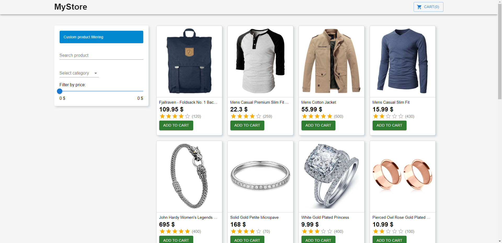
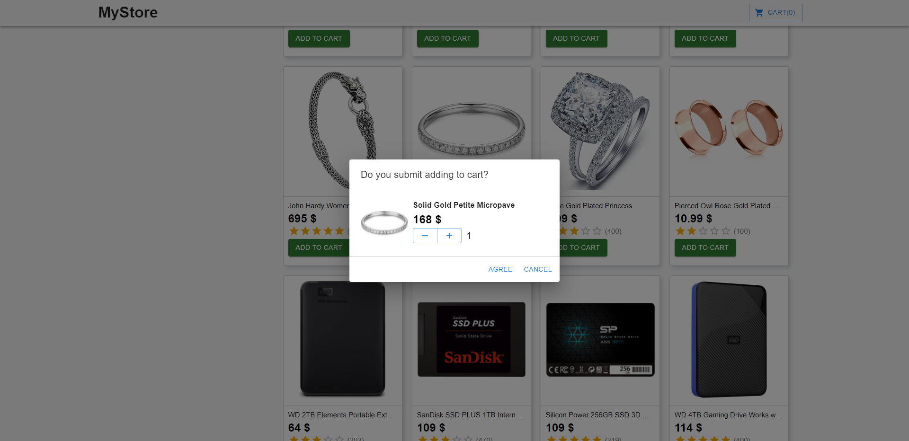
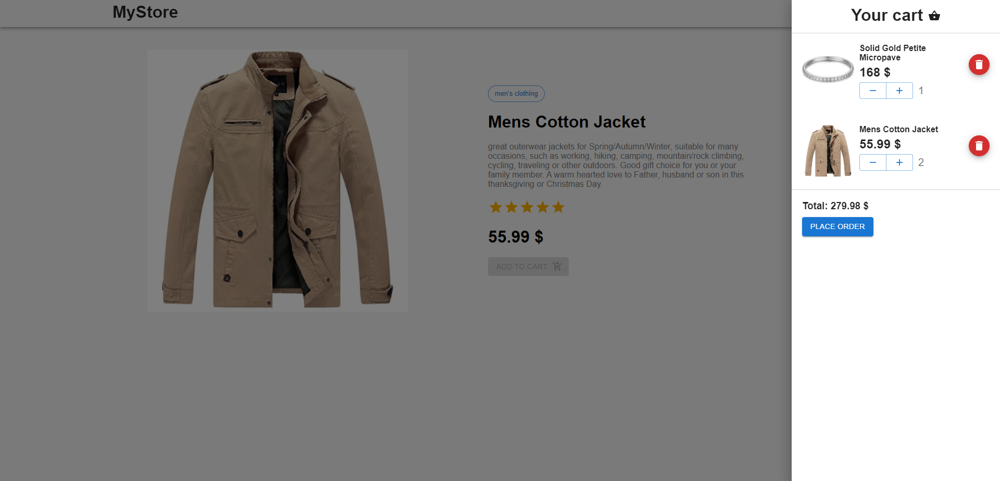

# 🏪Products shop
> E-commerce project built with React and TypeScript.
> Live demo [_here_](https://vadimturok.github.io/products-shop/#/).

> API used for this project [_here_](https://fakestoreapi.com/).

## Table of Contents
* [General Info](#general-information)
* [Technologies Used](#technologies-used)
* [Features](#features)
* [Screenshots](#screenshots)
* [Setup](#setup)
* [Project Status](#project-status)
* [Contact](#contact)
<!-- * [License](#license) -->


## General Information
Product shop with different types of products. Wide range of filtering items and searching functionality.
Linting and formatting code is provided by custom configuration using Webpack.


## Technologies Used
- React - version 18.1.0
- Redux Toolkit - version 1.8.1
- TypeScript - version 4.6.4
- Axios - version 0.27.2
- Material UI - version 5.6.4
- Webpack - version 5.72.0
- ESLint - version 8.14.0
- Husky - version 4.3.8
- Prettier - version 2.6.2


## Features
Main features of the app:
- Searching products by name
- Filtering products by categories
- Selecting range of price
- Skeleton loading screens
- Product page
- Adding products to cart
- Dialog windows for submitting or canceling user's actions
- Increasing, decreasing count of product with auto calculating total sum of order
- Removing products from cart
- Submitting orders


## Screenshots





## Setup
Run application in development environment:
```
npm install
npm start
```
Create production build:
```
npm run build
```


## Project Status
Project is: _completed_


## Contact
Contact with me via e-mail: turokvadim2510@gmail.com or on Twitter: [Vadim Turok](https://twitter.com/stefanio228)
